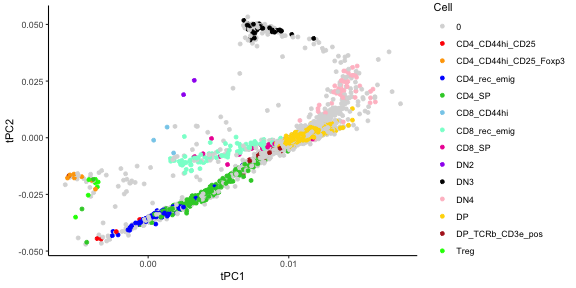
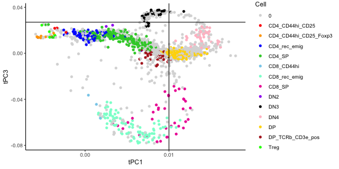
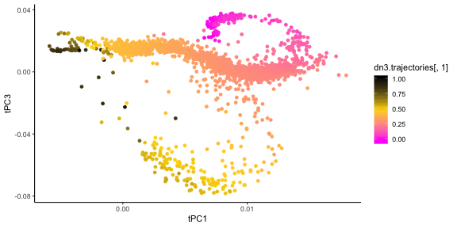
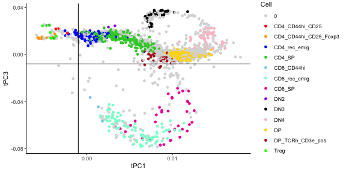
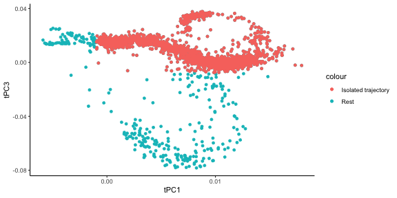
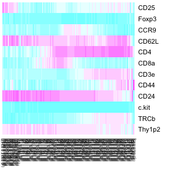
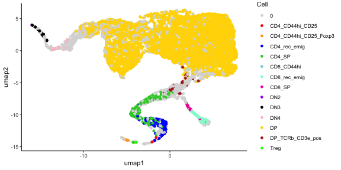

tSpace is an algorithm for trajectory inference. Depending on the platform used (FACS, CyTOF or single cell (sc) RNAseq) tSpace requires from the user to load previously transformed expression matrix into R workspace or selected principal componenets on variable genes e.g. significant principal components (PCs) on the variable genes, or, the first 50 (PCs) as commonly used in tSNE. As a general rule, FACS and CyTOF data have to be previously cleaned and pre-processed of all the noise/artifacts, and logicle, log `log` or ashin `asinh(x)` transformed. scRNAseq data should be normalized, log or square root `sqrt(x)` transformed and scaled. Expression matrix contains cells in the rows, and measured proteins/genes in the columns.

For the purpose of this tutorial, to make vignette fast, tSpace was already calculated on downsampled dataset (10000 cells) and stored in the package. We will use FACS data on T cell development in mouse thymus included in the package. In the real analysis we do not recommend downsampling, unless dataset has more than 500000 events.

## tSpace tutorial on precalculated demo T cell data, and handling the output of tSpace

Here we will load, previously calculated tSpace object `ts`, which is a list of objects: 

1. ts_file: a data frame of pca and/or umap embeddings of trajectory space matrix and input data. 

2. pca_tspace and/or umap_tspace: pca and/or UMAP objects, pca object contains all the outputs of pca analysis of trajectory matrix, umap contains all the outputs of the umap analysis (see umap package) of trajectory matrix.

3. tspace_matrix: trajectory space matrix with calculated distances, which can be used as a *pseudotime*. These objects can be extracted by using `$` operator. 


```r
library(tSpace)
data("ts")
```

Here we extract `ts_file` into variable `visualization`

For visualization we can use either tPCs or umap coordinates, and because cells have annotations, we will use them for visualization. In case user does not have cell annotations, one simple way to create them is to determine cell clusters and with the help of adequate genes/proteins perform annotation. First we show ggplot method, and then a 3D option using `plotly` package.


```r

visualization <- ts$ts_file
library(ggplot2)

ggplot(visualization, aes(tPC1, tPC2, color = Cell))+
  geom_point()+
  scale_color_manual(values =  c('gray85', 'red', 'orange', 'blue', 'limegreen', 'skyblue', '#88fcd1', '#ee00a4', 'purple', 'black', 'pink', 'gold', 'firebrick', 'green', 'slateblue'))+
  theme_classic()
```



```r

ggplot(visualization, aes(tPC1, tPC3, color = Cell))+
  geom_point()+
  scale_color_manual(values =  c('gray85', 'red', 'orange', 'blue', 'limegreen', 'skyblue', '#88fcd1', '#ee00a4', 'purple', 'black', 'pink', 'gold', 'firebrick', 'green', 'slateblue'))+
  theme_classic()
```


```r


library(plotly)

p3d <- plot_ly(visualization, x = visualization$tPC1, y = visualization$tPC2, z = visualization$tPC3, color = visualization$Cell, colors = c('gray85', 'red', 'orange', 'blue', 'limegreen', 'skyblue', '#88fcd1', '#ee00a4', 'purple', 'black', 'pink', 'gold', 'firebrick', 'green'), marker = list(size = I(4)), type = 'scatter3d', text = ~paste("Pop: ", visualization$Cell, "<br>Index: ", visualization$Index) ) %>%  
      layout(paper_bgcolor='transparent')

p3d
## No scatter3d mode specifed:
##   Setting the mode to markers
##   Read more about this attribute -> https://plot.ly/r/reference/#scatter-mode
```


## Isolation of the specific trajectory

Let's say we want to isolate a branch starting from DN3 population all the way to CD4 recent emigrants. Namely, due to downsampling DN2 population is lost, so we use DN3 as a start. These cells are labeled in black and can be determined by following filtering:


```r
ggplot(visualization, aes(tPC1, tPC3, color = Cell))+
  geom_point()+
  scale_color_manual(values =  c('gray85', 'red', 'orange', 'blue', 'limegreen', 'skyblue', '#88fcd1', '#ee00a4', 'purple', 'black', 'pink', 'gold', 'firebrick', 'green', 'slateblue'))+
  geom_vline(xintercept = 0.01)+
  geom_hline(yintercept = 0.027)+
  theme_classic()
```



Now, we have to find trajectories that start from DN3 population. We can do that by determining which trajectories from matrix `tspace_matrix` start from the cells around trajectory start (DN3 population) using cell indices. And examine distances along the selected trajectories visually.


```r

dn3.trajectories <- ts$tspace_matrix[,which(colnames(ts$tspace_matrix) %in% paste0('T_', visualization[which(visualization$tPC3 > 0.027 & visualization$tPC1 < 0.01), 'Index']))]


ggplot(visualization, aes(tPC1, tPC3, color = dn3.trajectories[,1]))+
  geom_point()+
  scale_color_gradientn(colours = c('magenta', 'gold', 'black'))+
  theme_classic()
```



```r

ggplot(visualization, aes(tPC1, tPC3, color = dn3.trajectories[,2]))+
  geom_point()+
  scale_color_gradientn(colours = c('magenta', 'gold', 'black'))+
  theme_classic()
```


```r

ggplot(visualization, aes(tPC1, tPC3, color = dn3.trajectories[,3]))+
  geom_point()+
  scale_color_gradientn(colours = c('magenta', 'gold', 'black'))+
  theme_classic()
```


Now, after inspection of all three isolated trajectories we see that they are pretty much concordant and we can calculate average trajectory of these three trajectories, which can be used for a heatmap that will show abundance changes of other proteins along the trajectory. 


```r

visualization$trajectory_dist <- rowMeans(dn3.trajectories)
```

Next, we have to isolate cells that are on the desired developmental branch, without branch towards single CD8 T cells. We can do that by filtering out cells using their embeddings in tPC1 and tPC3, as shown in below figure. Here we used tPC1 and tPC3 because these two visually represent trajectories better than tPC1 and tPC2.


```r
ggplot(visualization, aes(tPC1, tPC3, color = Cell))+
  geom_point()+
  scale_color_manual(values =  c('gray85', 'red', 'orange', 'blue', 'limegreen', 'skyblue', '#88fcd1', '#ee00a4', 'purple', 'black', 'pink', 'gold', 'firebrick', 'green'))+
  geom_vline(xintercept = -0.001)+
  geom_hline(yintercept = -0.008)+
  theme_classic()
```



```r

t.dn3.cd4 <- visualization[which(visualization$tPC1 > -0.001 & visualization$tPC3 > -0.008), ]

ggplot(visualization, aes(tPC1, tPC3, color = 'Rest'))+
  geom_point()+
  geom_point(data = t.dn3.cd4, mapping = aes(tPC1, tPC3, color = 'Isolated trajectory'))+
  theme_classic()
```



*Note 1*: Isolation of trajectories can be achieved outside the R in tools like FlowJo, JMP, by manually selecting/gating cells.

t.dn3.cd4 object contains only desired cells from DN3 to CD4 T cells. To order cells based on their trajectory distances and perform smoothing of the expression values along the isolated developmental sequence we will use a helper function `bin.trajectory`. For detailed description of the function and parameters check out`'?bin.trajectory`. 


```r

smooth.df <- bin.trajectory(x = t.dn3.cd4[,22:34], trajectory = t.dn3.cd4$trajectory_dist, n = 250, trim=T, stat = 'median')
## Some of the factor variables merged together in summarization process,
## because there was no clear over representation of one.
##                 
## Please check your factor columns and labels.

clean.df <- smooth.df[!is.na(smooth.df[,1]),]

heatmap(as.matrix(t(clean.df[,1:12])), Rowv = NA, Colv = NA, scale = 'none', col = cm.colors(12))
```



*Note 2*: During smoothing some bins may not contain any cells and average values will be NA, because of that we remove these rows `!is.na(smooth.df[,1])`. 

*Note 3*: If option "smooth" is used output will not be bins but cubic smoothed values for single events. 

## Exporting analysis files 
As a final step, if user wants to export files as csv files, basic R function `write.csv` will store files in the working directory.    

For storing of tSpace visualization: `write.csv(ts$ts_file, 'tSpace_embedding_file.csv')`
For storing of trajectory space matrix: `write.csv(ts$trajectory_matrix, 'Trajectory_space_matrix_file.csv')`

Similarly, `t.dn3.cd4` and `clean.df` objects can be stored.

## tSpace analysis of new dataset: introduction
To start with tSpace analysis user has to load tSpace package and proceed with its main function `tSpace`, for help on tSpace function and parameters type `?tSpace`.

For the first analysis we recommend to use default values, with the exception of waypoints (wp) which for smaller complexity data can be reduced to e.g. here 15. Usually 20 is a good number.
Dimensionality reduction for visualization option (dr) is set here to **pca** which will embed trajectory space matrix in PCA. However, tSpace can use UMAP for visualization purposes. Later in this tutorial we will show how to externally, post tSpace main analysis, run UMAP for visualization or calculate tSNE if user wants to use it. If user wants to automatically calculate within tSpace we recommend to specify parameter `seed` number becasue of UMAP visualization consistency. If tSpace is used on multicore computers, we recommend use of multiple cores because this will speed up calculation process significantly.

To run tSpace function user needs to run in the console:

`ts <- tSpace(df = your_data, K = 20, L = 15, D = 'pearson_correlation', graph = 5, trajectories = 200, wp = 15, dr = 'pca', core_no = 2)`

Below are comments reagrding choice of parameters.

### Commentary on tSpace parameters

#### Waypoints and number of trajectories 
In the accompanying [publication](https://doi.org/10.1101/336313), we examine (i) the effects of varying T (trajectory number) and effect of waypoints (ii) and the effects of graph number (G), K (L is maintained at 0.75K as default) and metric parameters. We demonstrate the power of waypoints (WP) and the importance of the number of trajectories on tSpace performance. WP are crucial element for tSpace to perform well. Based on our experience, the complexity of the dataset dictates number of WP; so far, we have used anything from 10 to 30 waypoints. 100-200 trajectories are needed to reveal the details of branching, however, for final analysis we suggest to calculate preferably larger number of trajectories (~1000) or ground truth if working with fewer than 10000 cells.

#### Comments on K and L 
Furthermore, we compare the effect of the number of sub-graphs, and varying K, L and different metrics (Euclidean and Pearson) and demonstrate the robustness of the output to K, the number of neighbors in the KNN graph, as long as K is kept reasonably low (but high enough for connectivity of the KNN graph). Intuitively large K, by increasing the number of ‘paths’ between cells, can lead to unwanted connections (short circuits) to developmentally more distant or altogether unrelated cells. We suggest to keep K small, and set the default to K=20. The parameter L defines the subset of K connections around each cell to be preserved in each of the sub-graphs, thus L must be < K. Keeping K and L small increases the sparseness of the graphs (reducing aberrant paths); but the ratio of L to K determines the independence of sub-graphs (which is also important to reduce the contribution of short-circuits). If L is kept as `NULL` tSpace will determine it as 0.75*K, a value that works well in all datasets we have analyzed. User can override that default by simply specifying L value.

#### Comments on metrics
In our analysis we used Euclidean and Pearson correlation metric, all commonly used in single cell analysis. Selection of metrics is dependent on the data type. For example, Euclidean distances may over-emphasize the contribution of phenotypic markers that are very highly expressed, unless markers are scaled to a similar range prior to tSpace. Pearson metric intrinsically compensates for this, focusing on the profile shapes rather than magnitudes.

## Additional steps how to visualize trajectory matrix

Trajectory matrix can be visualized outside tSpace function. UMAP with default parameters is incorporated in tSpace function, however user may want to play with parameters like min_dis and metric. For this step we will extract `tspace_matrix` form `ts` object and analyze with UMAP


```r
library(umap)


umap.conf <- umap.defaults
umap.conf$n_neighbors <- 7
umap.conf$metric <- 'pearson'
umap.conf$min_dist <- 0.3

set.seed(1111)

umap.ts <- umap(ts$tspace_matrix, config = umap.conf)

visualization <- cbind(visualization, umap.ts$layout)
colnames(visualization)[36:37] <- c('umap1', 'umap2')


ggplot(visualization, aes(umap1, umap2, color = Cell))+
  geom_point()+
  scale_color_manual(values =  c('gray85', 'red', 'orange', 'blue', 'limegreen', 'skyblue', '#88fcd1', '#ee00a4', 'purple', 'black', 'pink', 'gold', 'firebrick', 'green'))+
  theme_classic()
```




## Running the GUI for visualization
tSpace package has a function runExplorer for simple visualization of 2D and 3D plots on any data user wants to load as csv file. User just needs to run in the console command `runExplorer()`


